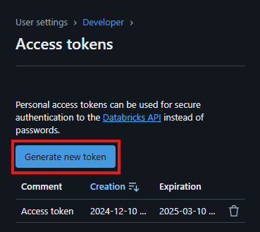

# End-to-End-Data-Engineering-Project

Notion Webpage: [https://prickle-orangutan-450.notion.site/End-to-End-Data-Engineering-Project-15873b21d05080c3acaedb35bfb57fbb](https://www.notion.so/End-to-End-Data-Engineering-Project-15873b21d05080c3acaedb35bfb57fbb?pvs=21)

.png)

The proposed solution aims to address the challenge of migrating an on-premises SQL database to the Azure cloud, transforming the data, and leveraging it to gain insights using visualization tools.

To simulate the data, we used the AdventureWorks 2017 ([link](https://learn.microsoft.com/en-us/sql/samples/adventureworks-install-configure?view=sql-server-ver16&tabs=ssms)) sample database, which is initially stored locally on SQL Server Management Studio.

## INGESTION

<aside>


### Azure Data Factory

</aside>

This is a Microsoft cloud service that enables the integration and orchestration of data from multiple sources. It simplifies the creation of ETL (Extract, Transform, Load) or ELT workflows, allowing the movement and transformation of data between cloud and on-premises services. It is ideal for preparing data for analysis in tools such as Azure Synapse Analytics, Power BI, or storing it in Data Lakes.

Using Azure Data Factory, we created a pipeline where the locally hosted tables are transferred to the cloud into a Data Lake.

<aside>


### Azure Data Lake Gen 2

</aside>

This is a cloud-based storage service optimized for massive-scale data, ideal for big data analytics. It combines the scalability and cost-efficiency of Azure Blob Storage with a hierarchical file system, making data organization and management easier. It is perfect for storing structured, semi-structured, and unstructured data and integrates seamlessly with tools like Azure Databricks, Synapse Analytics, and Azure Data Factory.

In our case, we store the data in an Azure Data Lake Gen 2 and used Databricks to transform the data.

## TRANSFORMATION

<aside>


### Azure Databricks

</aside>

This is a data analytics service built on Apache Spark, optimized for Azure. It enables real-time processing, transformation, and analysis of large volumes of data while combining machine learning, artificial intelligence, and big data capabilities. It provides a collaborative environment for data scientists, data engineers, and analysts, integrating with services like Azure Data Lake, Data Factory, Synapse Analytics, and Power BI.

Using Databricks, the data is transformed across the three layers:

<aside>


**Bronze Layer (Raw Layer)**:

Contains raw, unprocessed data as it is received from the sources. This data may include errors, duplicates, or unstructured formats.

</aside>

<aside>


**Silver Layer (Clean Layer)**:

Stores clean and transformed data. This layer involves processes like validation, deduplication, error correction, and format standardization. The data here is ready for exploratory analysis or integration into other tables.

For each loaded table, it is checked whether any column contains the word "Date" or "date." If a date column is found, it is converted from its UTC format to a standard yyyy-MM-dd format. This is done using the **from_utc_timestamp** function (to handle the timezone) and the **date_format** function (to apply the desired format).

</aside>

<aside>


**Gold Layer (Aggregated Layer):**

Contains data optimized for final consumption, including analytics, reporting, or machine learning. This layer includes aggregations, calculations, metrics, and highly modeled tables.

For each table, the column names are retrieved and a transformation is applied to convert the column names from CamelCase format (e.g., ColumnName) to snake_case format (e.g., column_name).

This renaming is achieved through a loop that iterates over the characters of each column name and uses a concatenation approach to add underscores between uppercase letters. The **lstrip("_")** expression ensures that no leading underscore is present in the name.

</aside>

## LOADING

<aside>


### Azure Synapse Analytics

</aside>

Is a Microsoft cloud analytics service that unifies enterprise data storage and big data analytics. It provides capabilities to query and analyze data at scale using SQL models (dedicated or serverless) and massive data processing with Apache Spark.

**Azure Synapse Analytics** allows the integration of data from various sources, such as Azure Data Lake and databases, making it ideal for real-time analytics, creating Power BI dashboards, and advanced modeling. Its flexibility makes it essential for implementing modern data warehouse architectures and integrated analytics.

It serves as a bridge to connect the data from the Gold layer with the visualization tool Power BI.

## REPORTING

<aside>


### Power BI

</aside>

Is a Microsoft business analytics tool that enables users to connect, transform, and visualize data in interactive reports and dashboards. It integrates with various data sources, both on-premises and in the cloud, such as Excel, SQL databases, Azure, and web services.

It is ideal for making data-driven decisions, thanks to its ease of use, advanced modeling and analytics capabilities, and its integration with tools like Azure Synapse Analytics and Microsoft Teams.

## SECURITY AND GOVERNANCE

<aside>


### Entra ID

</aside>

It is the primary service for identity management and access to cloud applications, providing authentication, authorization, and identity management for both internal and external users. In addition to these services, **Entra ID** integrates capabilities for access protection and permission management through advanced security policies.

Microsoft **Entra** also includes other security solutions, such as **Entra Permissions Management** and **Entra Verified ID**, for identity verification and data protection.

It is used to manage the credentials and access permissions for each member of our project.

<aside>


### Azure Key Vault

</aside>

It is a Microsoft Azure cloud service that helps protect secrets, encryption keys, certificates, and other sensitive data. It allows organizations to manage access to these resources securely, maintaining control over who can access critical information.

With **Azure Key Vault**, developers and IT administrators can securely store and access secrets such as passwords, API keys, and SSL certificates. Additionally, it easily integrates with other Azure services, such as Azure Active Directory (Entra ID), to enforce access policies and ensure that only authorized users or applications can access these items.

We store the credentials (primarily passwords) to enhance the security of all the services involved in this project.

---

## Shared Databricks workspace

1. First, we need to create and access our workspace. Once inside the workspace, go to **Settings** > **Users:**


2. Add user:


3. Once added, we can configure each user by clicking on the **︙**


4. Another useful management configuration is the **“Groups”** setting, where you can create workgroups and assign roles to each group in order to manage user groups effectively:


5. Just like with the “users” settings, we can create a new group and edit each of the existing ones by clicking on the **︙**


---

### Databricks token in Key Vault

1. We access the “Secrets” setting of our Key Vault:


2. We create a new secret, give it a name and copy the “Secret Value” :


3. Where can we find it? We need to go to our Databricks workspace, launch it, and then go to **User** > **Settings**. Once there, navigate to **Developer** > **Access Tokens :**


4. Generate a new token and, very importantly, make sure to copy it, as this is the only time we can view its content:



5. Back to Key Vault, we copy the value:


---

# Creating the on-premise SQL server database

---

As a prerequisite we need to have SQL Server, SQL Server Managment Studio 20 and the AdventureWorks2017 bak file in our computer:

- [SQL Server](https://go.microsoft.com/fwlink/p/?linkid=2215158&clcid=0x40A&culture=es-es&country=es)
- [SQL Server Managment Studio 20](https://aka.ms/ssmsfullsetup)
- [AdventureWorksLT2017.bak](https://github.com/Microsoft/sql-server-samples/releases/download/adventureworks/AdventureWorksLT2017.bak)

Once we have everything, the AdventureWorksLT2017.bak file has to be placed in the next directory:

```makefile
C:\Program Files\Microsoft SQL Server\MSSQL16.MSSQLSERVER\MSSQL\Backup
```

1. Open  SQL Server Managment Studio 20


2. When it connects, we have to right clic on “databases” and then “Restore Database”


3. Choose device and clic the three dots on the right


4. A new window will show in which we´re selecting “Add”


5. Finally, we select the .bak file and every “Ok” button until this window shows up:


## Configure SQL Server for remote access:

To make sure we can connect through Azure to our local database this are the settings that need to be configured:

1. Create new user, under “Security” > “Users”, right clic and “New User”:


2. Fill the fields…


3. Check db_datareader under the Membership tab and clic “OK”


4. Also ensure that server authentication is on “SQL Server and Windows Authentication mode” and the server allows remote connections. So, to check this we have to right clic on the server:


With this steps we have almost everything configured on the local part.

# Create Resource Group

---


1. Once in Azure, we click on “Resource groups”:


2. Inside Resource groups, we create a new one:


3. We give the resource group a name (I´m calling ours “ddmrs-proyecto-1”), and the region in which the group is going to be located.


4. I created no tags here.


5. And finally, we review and create it.


# Create Azure Synapse Analytics and Datalake Storage Gen2

---

1. The first step is opening our resource group from the resource groups tab:


2. Once we select it, we click on “create”:


3. Inside the marketplace, search for synapse analytics, and once found, create the resource:


4. We then configure the basics page as shown below, and also create the Data Lake Storage Gen2 and file system (Bronze) that we will use to store the data from the on-premise sql server. 


5. We are not modifying any of the next config pages, so we can skip directly to “Review and create”


# Creating bronze-silver-gold hierarchy

---

1. Access the datalake storage account inside Azure portal
2. Go to the “Storage brower” tab
3. Click on “Blob containers”
4. We should be able to see that bronze is already created. That was done while creating the Azure Synapse Analytics workspace
5. Click on “Add container” at the top of the screen
6. Write “silver” inside the “Name” text input, then click on “Create”
7. Repeat step 6 for “gold”

# Create Azure Data Factory

---

1. We look for Azure Databricks in the azure search bar and clic on “Azure Data Factory”
2. Then clic on “create”
3. In the “Basics” tab we fill the following information:
    1. Resource group → ddmrs-proyecto-1
    2. Name → ddmrs-data-factory
    3. Region → France Central
4. Finally, click on “Review + create” 

# Create Azure Databricks

---

1. We look for Azure Databricks in the azure search bar and click on “Azure Databricks”


1. Then click on “create”


1. We choose the resource group


1. We don’t change any of the following configurations, so we just need to review an create the resource:


# Create Azure Key Vault

1. We look for Azure Databricks in the azure search bar and clic on “Azure Key Vaults”
2. Then clic on “create”
3. Afterwards fill the info like this:
    1. Key vault name → ddmrs-key-vault
    2. Region → France Central
    3. Pricing tier → Standard
4. Lastly change to the configuration tab and check the “Vault access policy option” and create the resource

# Creating SQL Database User Login as a Secret in Azure Key Vault

## Username

1. Access the key vault inside Azure portal
2. Go to the “Secrets” tab inside the “Objects” menu
3. Click on “Generate/Import”
4. Fill the information like this:
    1. Name → username
    2. Secret value → rober (Paste here your sql database username instead of “rober”)
5. Click on “Create”

## Password

1. Access the key vault inside Azure portal
2. Go to the “Secrets” tab inside the “Objects” menu
3. Click on “Generate/Import”
4. Fill the information like this:
    1. Name → password
    2. Secret value → (Paste here your sql database user password)
5. Click on “Create”

# Connecting SQL Database to Azure Datafactory

1. Access the datafactory inside Azure portal
2. Click on “Launch studio”
3. Click on the “Manage” tab at the left sidebar
4. Click on “Integration Runtimes”
5. Click on “New”
6. Select “Azure, Self-Hosted” and “continue"
7. Select “Self-Hosted”
8. Give it a name, we named it “SHIR” and click on “Create”
9. Click on “Express Setup” and install that in the computer with SQL Database 

# Creating the Pipelines for Copying Data from SQL Database to Azure Datalake Storage Gen2

## Lookup for getting table names

1. From the Azure Data Factory studio click on the “Author” tab
2. Click on the “+” icon, then click on “pipeline”
3. In the Activity search bar write “Lookup”, drag and drop the result to the right
4. In the bottom tabs select “settings”
5. Add a new source dataset
6. We search and select sql server
7. On the linked service section we select “onpremsqlserver” and click “ok”
8. Going back to the settings tab, we have to change the “Use query” selection to “Query”
9. Then we paste the folowing code into the textarea for “Query”
    
    ```jsx
    SELECT
    s.name AS SchemaName,
    t.name AS TableName
    FROM sys.tables t
    INNER JOIN sys.schemas s
    ON t.schema_id = s.schema_id
    WHERE s.name = 'SalesLT'
    ```
    
10. After that we uncheck the box for “First row only”

## For-Each for copying the tables into the adls2

1. In the “Activities” left sidebar, look for “ForEach” and drag it into the board
2. Link the Lookup activity with the ForEach with a success arrow
3. Select the “ForEach” activity
4. Go to the “Settings” tab
5. Click on the “Items” text area, then click on “Add dynamic content”
6. In the new section write the following code:
    
    ```python
    @activity('Look for all tables').output.value
    ```
    
7. Click on “ok”

### Creating the copy activity inside the ForEach

1. While having “ForEach” selected, click on the “Activities” tab
2. Click on the pencil icon
3. In the “Activities” left sidebar, look for “Copy data” and drag it into the board
4. Select it and go to the “Source” tab
5. Click on “+New”
6. Select “SQL server”
7. Change the name to something like “SqlServerCopy” and select “onpremsqlserver” as the Linked service
8. Click “OK”

# Creating the Computing Unit in Azure Databricks

1. Go to the “compute” section
2. click on “create” button
3. give a custom name
4. select “single node”
5. select in Access mode “No isolation shared”
6. leave default runtime
7. Select in Node type “Standard_DS3_v2

# Creating the Notebooks in Azure Databricks

## Creating the Connection Notebook

```python
configs = {
    "fs.azure.account.key.datalakegroup2.blob.core.windows.net": ""
}
```

```python
dbutils.fs.mount(
    source="wasbs://bronze@datalakegroup2.blob.core.windows.net/",
    mount_point="/mnt/bronze",
    extra_configs=configs
)
```

```python
dbutils.fs.mount(
    source="wasbs://silver@datalakegroup2.blob.core.windows.net/",
    mount_point="/mnt/silver",
    extra_configs=configs
)
```

```python
dbutils.fs.mount(
    source="wasbs://gold@datalakegroup2.blob.core.windows.net/",
    mount_point="/mnt/gold",
    extra_configs=configs
)
```

## Creating the First Transformation Notebooks (bronze - silver)

we need to create a table and store in it every single register we have in mnt/bronze/SalesLT

```python
table_name = []

for i in dbutils.fs.ls('mnt/bronze/SalesLT/'):
    table_name.append(i.name.split('/')[0])
```

In this code fragment we have a module to format every date contained in each parquet file so that they have the same structure.

```python
from pyspark.sql.functions import from_utc_timestamp, date_format
from pyspark.sql.types import TimestampType

for i in table_name:
  path = '/mnt/bronze/SalesLT/' + i + '/' + i + '.parquet'
  df = spark.read.format('parquet').load(path)
  column = df.columns

  for col in column:
    if "Date" in col or "date" in col:
      df = df.withColumn(col, date_format(from_utc_timestamp(df[col].cast(TimestampType()), "UTC"), "yyyy-MM-dd"))

  output_path = '/mnt/silver/SalesLT/' +i +'/'
  df.write.format('delta').mode("overwrite").save(output_path)
```

After this, we can use df.display() to see if the transformation has worked out correctly

## Creating the Second Transformation Notebooks (silver - gold)

We store every subdirectory name in a list

```python
table_name = []

for i in dbutils.fs.ls('mnt/silver/SalesLT/'):
  print(i.name)
  table_name.append(i.name.split('/')[0])
```

load the delta files in each silver path into a dataframe named “df”

```python
for name in table_name:
  path = '/mnt/silver/SalesLT/' + name
  print(path)
  df = spark.read.format('delta').load(path)
```

To get a further transformation in the data, we start by changing the column name of each column into Snake Case (separated by _ )

Later we rename every column with the new name in the dataframe df

this way we are treating data in a columnar way, a process considered an upgrade from silver to gold

```python
column_names = df.columns

for old_col_name in column_names:
  # Convert column name from ColumnName to Column_Name format
  new_col_name = "".join(["_" + char if char.isupper() and not old_col_name[i - 1].isupper() else char for i, char in enumerate(old_col_name)]).lstrip("_")
      
  # Change the column name using withColumnRenamed and regexp_replace
  df = df.withColumnRenamed(old_col_name, new_col_name)

  output_path = '/mnt/gold/SalesLT/' +name +'/'
  df.write.format('delta').mode("overwrite").option("mergeSchema", "true").save(output_path)
```

# Connecting Azure Databricks to Data Factory

# Creating a Data Factory Pipeline to Run Databricks Notebooks

# Creating SQL Pool in Azure Synapse Analytics

# Creating a Stored Procedure with Parameters that can Dynamically Create

# Creating a New Link Service Connection to Connecto to the Serverless SQL Database

# Creating the Link Service

# Creating Azure Synapse Analytics Pipeline to Create a Delta View for Each Table

# Connecting PowerBI to Azure Synapse Analytics

# Creating Permissions For Synapse Analytics


# Alternative Solution

