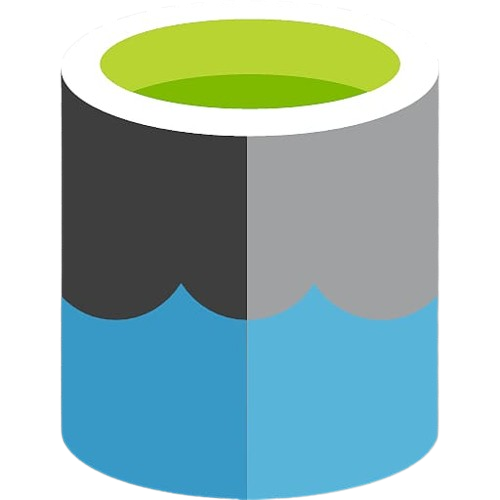
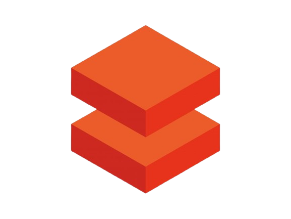

# End-to-End-Data-Engineering-Project

Notion Webpage: [End-to-End-Data-Engineering-Project](https://www.notion.so/End-to-End-Data-Engineering-Project-15873b21d05080c3acaedb35bfb57fbb?pvs=21)

.png)

The proposed solution aims to address the challenge of migrating an on-premises SQL database to the Azure cloud, transforming the data, and leveraging it to gain insights using visualization tools.

To simulate the data, we used the AdventureWorks 2017 ([link](https://learn.microsoft.com/en-us/sql/samples/adventureworks-install-configure?view=sql-server-ver16&tabs=ssms)) sample database, which is initially stored locally on SQL Server Management Studio.

## INGESTION

<aside>

### Azure Data Factory

</aside>

This is a Microsoft cloud service that enables the integration and orchestration of data from multiple sources. It simplifies the creation of ETL (Extract, Transform, Load) or ELT workflows, allowing the movement and transformation of data between cloud and on-premises services. It is ideal for preparing data for analysis in tools such as Azure Synapse Analytics, Power BI, or storing it in Data Lakes.

Using Azure Data Factory, we created a pipeline where the locally hosted tables are transferred to the cloud into a Data Lake.

<aside>

### Azure Data Lake Gen 2

</aside>

This is a cloud-based storage service optimized for massive-scale data, ideal for big data analytics. It combines the scalability and cost-efficiency of Azure Blob Storage with a hierarchical file system, making data organization and management easier. It is perfect for storing structured, semi-structured, and unstructured data and integrates seamlessly with tools like Azure Databricks, Synapse Analytics, and Azure Data Factory.

In our case, we store the data in an Azure Data Lake Gen 2 and used Databricks to transform the data.

## TRANSFORMATION

<aside>

### Azure Databricks

</aside>

This is a data analytics service built on Apache Spark, optimized for Azure. It enables real-time processing, transformation, and analysis of large volumes of data while combining machine learning, artificial intelligence, and big data capabilities. It provides a collaborative environment for data scientists, data engineers, and analysts, integrating with services like Azure Data Lake, Data Factory, Synapse Analytics, and Power BI.

Using Databricks, the data is transformed across the three layers:

<aside>

**Bronze Layer (Raw Layer)**:

Contains raw, unprocessed data as it is received from the sources. This data may include errors, duplicates, or unstructured formats.

</aside>

<aside>

**Silver Layer (Clean Layer)**:

Stores clean and transformed data. This layer involves processes like validation, deduplication, error correction, and format standardization. The data here is ready for exploratory analysis or integration into other tables.

For each loaded table, it is checked whether any column contains the word "Date" or "date." If a date column is found, it is converted from its UTC format to a standard yyyy-MM-dd format. This is done using the **from_utc_timestamp** function (to handle the timezone) and the **date_format** function (to apply the desired format).

</aside>

<aside>

**Gold Layer (Aggregated Layer):**

Contains data optimized for final consumption, including analytics, reporting, or machine learning. This layer includes aggregations, calculations, metrics, and highly modeled tables.

For each table, the column names are retrieved and a transformation is applied to convert the column names from CamelCase format (e.g., ColumnName) to snake_case format (e.g., column_name).

This renaming is achieved through a loop that iterates over the characters of each column name and uses a concatenation approach to add underscores between uppercase letters. The **lstrip("_")** expression ensures that no leading underscore is present in the name.

</aside>

## LOADING

<aside>

### Azure Synapse Analytics

</aside>

Is a Microsoft cloud analytics service that unifies enterprise data storage and big data analytics. It provides capabilities to query and analyze data at scale using SQL models (dedicated or serverless) and massive data processing with Apache Spark.

**Azure Synapse Analytics** allows the integration of data from various sources, such as Azure Data Lake and databases, making it ideal for real-time analytics, creating Power BI dashboards, and advanced modeling. Its flexibility makes it essential for implementing modern data warehouse architectures and integrated analytics.

It serves as a bridge to connect the data from the Gold layer with the visualization tool Power BI.

## REPORTING

<aside>

### Power BI

</aside>

Is a Microsoft business analytics tool that enables users to connect, transform, and visualize data in interactive reports and dashboards. It integrates with various data sources, both on-premises and in the cloud, such as Excel, SQL databases, Azure, and web services.

It is ideal for making data-driven decisions, thanks to its ease of use, advanced modeling and analytics capabilities, and its integration with tools like Azure Synapse Analytics and Microsoft Teams.

## SECURITY AND GOVERNANCE

<aside>

### Entra ID

</aside>

It is the primary service for identity management and access to cloud applications, providing authentication, authorization, and identity management for both internal and external users. In addition to these services, **Entra ID** integrates capabilities for access protection and permission management through advanced security policies.

Microsoft **Entra** also includes other security solutions, such as **Entra Permissions Management** and **Entra Verified ID**, for identity verification and data protection.

It is used to manage the credentials and access permissions for each member of our project.

<aside>

### Azure Key Vault

</aside>

It is a Microsoft Azure cloud service that helps protect secrets, encryption keys, certificates, and other sensitive data. It allows organizations to manage access to these resources securely, maintaining control over who can access critical information.

With **Azure Key Vault**, developers and IT administrators can securely store and access secrets such as passwords, API keys, and SSL certificates. Additionally, it easily integrates with other Azure services, such as Azure Active Directory (Entra ID), to enforce access policies and ensure that only authorized users or applications can access these items.

We store the credentials (primarily passwords) to enhance the security of all the services involved in this project.

[Siguiente](https://github.com/Daniel-Tajamar/End-to-End-Data-Engineering-Project/blob/main/creating-on-premise-SQL-server-database.md)