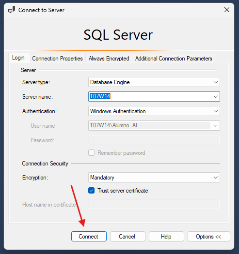

# Creating the on-premise SQL server database

---

As a prerequisite we need to have SQL Server, SQL Server Managment Studio 20 and the AdventureWorks2017 bak file in our computer:

- [SQL Server](https://go.microsoft.com/fwlink/p/?linkid=2215158&clcid=0x40A&culture=es-es&country=es)
- [SQL Server Managment Studio 20](https://aka.ms/ssmsfullsetup)
- [AdventureWorksLT2017.bak](https://github.com/Microsoft/sql-server-samples/releases/download/adventureworks/AdventureWorksLT2017.bak)

Once we have everything, the AdventureWorksLT2017.bak file has to be placed in the next directory:

```makefile
C:\Program Files\Microsoft SQL Server\MSSQL16.MSSQLSERVER\MSSQL\Backup
```

1. Open  SQL Server Managment Studio 20



2. When it connects, we have to right clic on “databases” and then “Restore Database”


3. Choose device and clic the three dots on the right


4. A new window will show in which we´re selecting “Add”


5. Finally, we select the .bak file and every “Ok” button until this window shows up:


[Siguiente](https://github.com/Daniel-Tajamar/End-to-End-Data-Engineering-Project/blob/main/configure-SQL-server-for-remote-access.md)